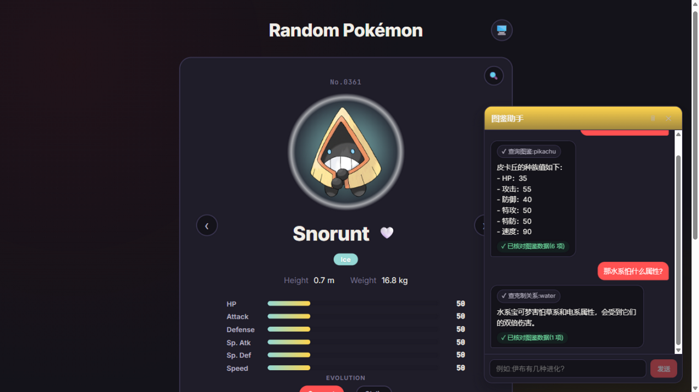

# Pokémon Dex AI · 宝可梦图鉴 AI 版

> 在一只宝可梦图鉴上,长出一个 AI 问答助手:自然语言提问 → 模型通过 **Function Calling**
> 实时查 PokeAPI → 流式输出回答 → **幻觉校验器**逐项核对答案里的数据。



*右侧:AI 助手实时调用工具查询图鉴,流式输出回答,底部绿色徽章是校验器对 6 项数值断言的核对结果。*

## 它能做什么

**AI 问答(核心)**

- 问"妙蛙种子有多重?""水系怕什么属性?""伊布有几种进化?"——模型自己决定调哪个工具,
  查到真实数据后才回答;中文译名自动转英文名
- 工具调用过程在界面上实时可视化(哪个工具、查了什么、成败),而不是黑盒等待
- 每条回答经过幻觉校验:数值断言(种族值/身高/体重)与类型克制断言("A 克 B"两个方向)
  逐一对照工具返回的事实表;不符自动纠错一次,再不符则向用户标注警示
- 回答逐字流式输出;随时停止;查询失败/模型限流/网络中断各有分层兜底提示

**图鉴本体**

- 1010 只宝可梦:搜索(自动补全 + 输入校验)、编号翻阅、进化链追踪、收藏(localStorage)、
  深浅色主题(跟随系统)、响应式布局——详见 [FEATURES.md](FEATURES.md)

## 架构

```
浏览器 (React)                Node/Express 服务端                 外部
┌─────────────┐   POST /api/chat   ┌──────────────┐   tools    ┌─────────┐
│ useChat      │◀────SSE 流────────│ agent.ts 循环 │──────────▶│ PokeAPI │
│ (手写SSE解析)│    delta/tool/... │  ↓ 每个 tool  │            └─────────┘
└─────────────┘                    │  结果进事实表  │   chat      ┌─────────┐
                                   │ guard.ts 校验 │◀──stream───│ GLM API │
                                   └──────────────┘             └─────────┘
```

| 层 | 技术 | 关键决策 |
|---|---|---|
| 前端 | React 19 · Vite · JS | fetch + ReadableStream 手写 SSE 解析(EventSource 不支持 POST) |
| 服务端 | Node 20+ · Express · TypeScript | 自研 Agent 工具循环(不用 SDK,约 700 行,每步可解释) |
| 模型 | GLM-4-Flash(智谱,免费) | OpenAI 兼容接口;`GLM_MODEL` 可切换 |
| 数据 | PokeAPI | 工具返回值裁剪、进程内缓存、枚举约束参数 |

**无 LLM key?自动进入演示模式**:mock 模型 + 真实 PokeAPI 工具,整条链路照常运转,
适合本地体验与回归测试。

## 快速开始

要求 Node.js 18+。

```bash
npm install

# 方式一:AI 服务 + 前端热更(开发)
npm run dev:ai        # 终端 1:API 服务 http://localhost:5178(无 key 自动 mock)
npm run dev           # 终端 2:Vite 开发服 http://localhost:5177

# 方式二:生产模式(单进程托管静态 + API)
npm run build         # 构建前端 dist/ 与服务端 server/dist/
npm start             # http://localhost:5178
```

接入真实模型:到 [bigmodel.cn](https://open.bigmodel.cn) 免费注册,把 key 写入 `.env.local`
(参考 [.env.example](.env.example)),重启即可。

## 部署

单进程 Express 同时托管静态页面与 `/api`,一个容器/一个端口搞定:

```bash
docker build -t pokemon-dex-ai .
docker run -p 3000:3000 -e GLM_API_KEY=你的key pokemon-dex-ai
```

任意 Node PaaS 亦可:build = `npm run build`,start = `npm start`。

## 文档

- [server/README.md](server/README.md) — 设计决策详解:工具 schema、Agent 循环的失控防护、
  幻觉校验的保守原则、SSE 的坑(Node `req`/`res` close 之别)、失败兜底矩阵
- [docs/ROADMAP.md](docs/ROADMAP.md) — 演进路线:账号与卡牌收藏、AI 推荐顾问、AI 对战模拟
- [FEATURES.md](FEATURES.md) — 图鉴功能完整导览
