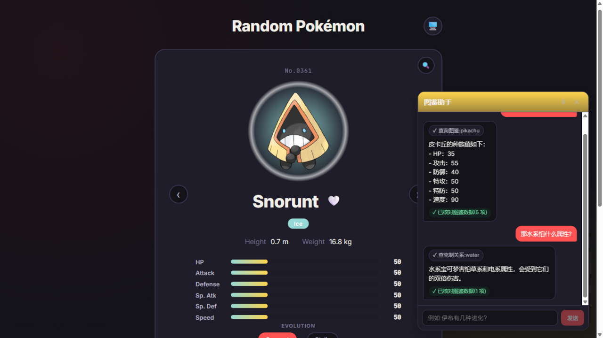

# Pokémon Dex AI · 宝可梦图鉴 AI

> 从一只宝可梦图鉴长出来的完整产品:**AI 图鉴问答**(Function Calling + 幻觉校验)、
> **卡牌收集与开包**(概率公示 + 幂等扣费)、**AI 推演对战**(服务器权威结算)——
> 一只会思考的宝可梦图鉴。

**在线体验:<https://pokemon-dex-ai.vercel.app>**(免费档全链路,打开即玩)



*AI 助手实时调用工具查询图鉴,流式输出回答;底部徽章是幻觉校验器对数值断言的核对结果。*

## 功能总览

**🏠 游戏大厅** — 品牌 Hero、四大功能入口、每日精选宝可梦(按日期确定)、个人冒险数据

**📖 智能图鉴(AI 问答,核心)**
- 自然语言提问 → 模型通过 **Function Calling** 实时查 PokeAPI → 流式输出
- 工具调用过程全程可视化,不是黑盒等待
- **幻觉校验器**:数值断言与类型克制断言逐一对照事实表,不符自动纠错一次,
  再不符向用户标注警示(宁漏判不误判)
- 1010 只宝可梦:搜索补全、编号翻阅、进化链、收藏、官方中文译名与图鉴说明

**🎴 卡包商店**
- 三档卡包,概率全公示;抽卡有开包仪式动画(摇晃→炸开→揭晓)
- **幂等扣费**:订单号绑定购买意图,响应丢失后重试同一订单不会重复扣费
- 钱包流水明细(收入/支出,类型徽章)

**🎒 我的收藏**
- 收藏网格 + 属性筛选;三只编队组成对战队伍,选中状态金色描边
- 集换式卡框:属性色卡头、官方立绘、稀有度绶带、UR 金框流彩

**⚔️ 对战竞技场**
- 编队 3 只 vs 随机 AI 阵容,服务器权威结算(客户端只做演出)
- 两种模式:**规则对手** / **AI 推演**——GLM 实时为 AI 选行动并给出理由,
  理由中的数值声明经守卫核对,不符自动标注
- 招式按属性着色、类型克制倍率提示、命中/受击/倒地演出、胜利彩带

**🎨 全站体验**
- 原神式开屏动画(每次加载,可跳过)、视图切换过渡、网格逐项入场
- 深浅色主题(跟随系统)、移动端底部导航、`dvh`/动画减负适配真机
- PWA 可安装(manifest + 矢量图标)

## 架构

```
浏览器 (React SPA)              Node/Express 服务端                    外部
┌──────────────┐  POST /api/chat  ┌────────────────┐   tools   ┌─────────┐
│ useChat      │◀──SSE 流────────│ agent.ts 工具循环│──────────▶│ PokeAPI │
│ (手写SSE解析)│  delta/tool/...  │  ↓ guard.ts     │           └─────────┘
└──────────────┘                  │  幻觉校验        │  chat     ┌─────────┐
┌──────────────┐  REST(编队/抽卡/│  └──────────────┤◀─stream───│ GLM API │
│ 业务视图      │  对战/流水)      │ battles 表      │           └─────────┘
│ (懒加载分包) │────────────────▶│ (JSONB 快照 +   │
└──────────────┘   乐观锁并发控制  │  乐观锁并发控制) │      ┌─────────┐
                                   └────────────────┘◀─────│ Neon PG │
                                                           └─────────┘
```

| 层 | 技术 | 关键决策 |
|---|---|---|
| 前端 | React 19 · Vite · JS | fetch+ReadableStream 手写 SSE 解析;路由级懒加载;视图级 ErrorBoundary |
| 服务端 | Node 20+ · Express · TS | 自研 Agent 工具循环(约 700 行);对战**服务器权威结算** + 乐观锁防并发双结算 |
| 模型 | GLM-4-Flash(智谱,免费) | OpenAI 兼容接口;失败自动回退规则策略,战斗永不因模型停摆 |
| 数据 | Neon Postgres · PokeAPI | DDL 内嵌代码(serverless 打包只跟 JS);scrypt 密码;会话 7 天;抽卡幂等键 |

## 工程要点(面试可讲的那些)

- **幻觉守卫**:AI 回答里的数值/克制声明逐项对照工具事实表,错则自动纠错一轮,再错则标注——"宁漏判不误判"
- **抽卡幂等**:客户端生成订单号,服务端以 `(user_id, order_id)` 为主键;并发重复扣费被主键冲突回滚后重放,用户无感
- **对战并发**:乐观锁(`WHERE status='active'`)+ 行数判定,并发双击/重放不会双发奖励或复活已结束战斗
- **serverless 适配**:DDL 内嵌为代码常量(打包只跟 JS);Neon 免费档断连自动重试
- **质量台账**:[qa/findings.md](qa/findings.md) 33 项全销项;视觉迭代 6 轮记录与截图证据在 [docs/visual-iteration-log.md](docs/visual-iteration-log.md) 与 [qa/shots/](qa/shots/)

## 快速开始

要求 Node.js 18+ 与 Docker(可选)。

```bash
npm install

# 开发:API 服务 + 前端热更
npm run dev:ai        # 终端 1:http://localhost:5178(无 key 自动 mock)
npm run dev           # 终端 2:http://localhost:5177

# 生产模式(单进程托管静态 + API)
npm run build
npm start             # http://localhost:5178
```

接入真实模型:[bigmodel.cn](https://open.bigmodel.cn) 免费注册,key 写入 `.env.local`
(参考 [.env.example](.env.example))。**无 key 自动进入演示模式**:mock 模型 +
真实 PokeAPI 工具,整条链路照常运转。

需要数据库(账号/卡包/对战):配置 `DATABASE_URL`(任意 Postgres;建表会在
首次请求时自动执行)。

## 部署

**Vercel(当前线上)**:`vercel --prod`,Postgres 用 Neon 免费档(市场一键开通)。

**Docker**:单进程 Express 托管静态与 API:

```bash
docker build -t pokemon-dex-ai .
docker run -p 3000:3000 -e GLM_API_KEY=你的key -e DATABASE_URL=postgres://... pokemon-dex-ai
```

## 测试

```bash
node qa/e2e.mjs         # API 端到端 36 断言(注册/钱包/幂等抽卡/编队/对战/并发)
node qa/battle.test.mjs # 对战引擎单测 17 断言(伤害公式/克制/替换/结束)
```

## 文档

- [server/README.md](server/README.md) — Agent 循环失控防护、幻觉校验保守原则、SSE 的坑
- [docs/acceptance.md](docs/acceptance.md) — 里程碑验收清单(唯一验收靶子)
- [qa/findings.md](qa/findings.md) — QA 台账:33 项发现全销项,含根因与修复 commit
- [docs/visual-iteration-log.md](docs/visual-iteration-log.md) — 6 轮视觉迭代:评分曲线与截图证据
- [docs/ROADMAP.md](docs/ROADMAP.md) — 演进路线(PvP 与更多)
